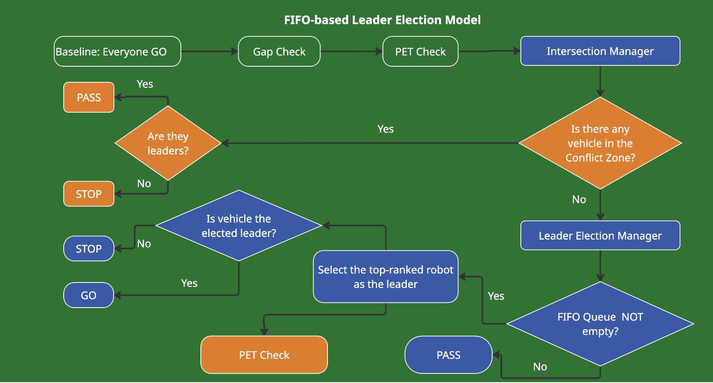

# Leader_Election_Model
**MSc Transport with Data Science Drssertation**
**RoboTraffic: Heuristic Leader Selection for Collaborative Intersection Control: A Step Toward Signal-Free Traffic Management?**

Thank you for reading the Appendix. 

**Model C:Heuristic-based Model**

**Model B:FIFO-based Model**

**Model A:Ruled-based Model**

